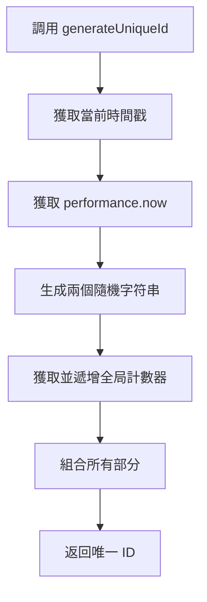
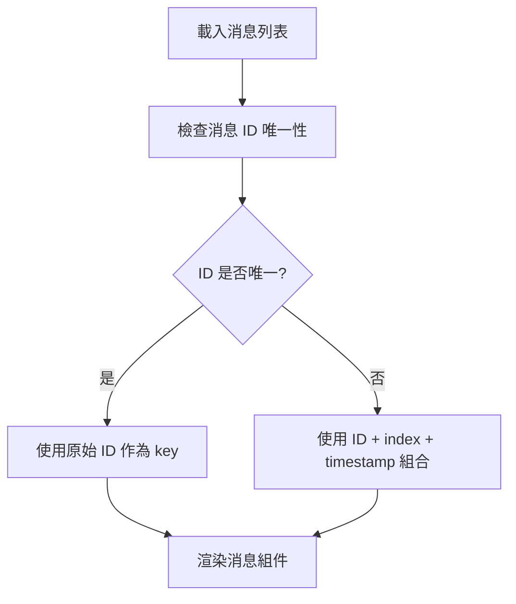
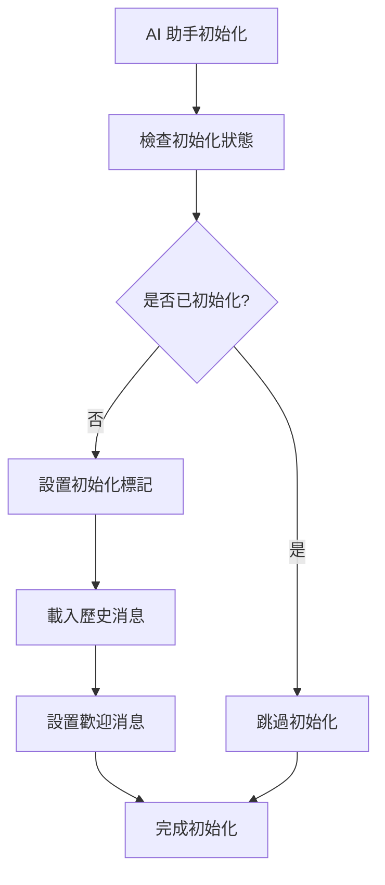

# Design Document

## Introduction

本設計文檔描述了修復 AI 助手對話視窗中 React key 重複警告和意外行程創建問題的技術方案。通過分析根本原因並提供具體的解決方案，確保系統的穩定性和用戶體驗。

## Problem Analysis

### 1. React Key 重複問題分析

根據錯誤信息和代碼分析，問題出現在以下幾個方面：

#### 1.1 ID 生成函數的問題
當前的 `generateUniqueId` 函數使用以下組合：
- `Date.now()` - 毫秒級時間戳
- `Math.random()` - 隨機數
- `performance.now()` - 高精度時間戳
- 隨機計數器

在 React StrictMode 下，組件會被雙重渲染，可能導致在極短時間內生成相同的 ID。

#### 1.2 消息渲染中的 Key 使用
在 `ChatDialog.jsx` 中，消息使用 `message.id` 作為 key，但如果 ID 生成有問題，就會出現重複。

### 2. 意外行程創建問題分析

通過代碼分析發現，問題可能出現在：
- AI 助手初始化時的副作用
- 消息載入過程中觸發的邏輯
- React StrictMode 下的雙重執行

## Technical Design

### 1. 改進 ID 生成機制

#### 1.1 新的 ID 生成策略

```javascript
// 使用更強的唯一性保證
const generateUniqueId = (type) => {
  const timestamp = Date.now();
  const performanceNow = performance.now();
  const random1 = Math.random().toString(36).substr(2, 9);
  const random2 = Math.random().toString(36).substr(2, 9);
  
  // 添加一個遞增計數器確保唯一性
  if (!window._idCounter) {
    window._idCounter = 0;
  }
  window._idCounter++;
  
  return `${type}_${timestamp}_${performanceNow.toString().replace('.', '')}_${random1}_${random2}_${window._idCounter}`;
};
```

#### 1.2 ID 生成流程圖



### 2. 消息渲染優化

#### 2.1 Key 屬性改進

確保每個消息元素都有穩定且唯一的 key：

```javascript
// 在消息渲染時添加額外的唯一性檢查
messages.map((message, index) => (
  <MessageBubble 
    key={`${message.id}_${index}_${message.timestamp}`} 
    $isUser={message.type === MESSAGE_TYPES.USER}
  >
    {/* 消息內容 */}
  </MessageBubble>
))
```

#### 2.2 消息列表渲染流程



### 3. 防止意外行程創建

#### 3.1 AI 助手初始化改進

在 `AIAssistantContext.jsx` 中添加初始化標記：

```javascript
const [isInitialized, setIsInitialized] = useState(false);

useEffect(() => {
  if (!isInitialized) {
    // 只在首次初始化時執行
    setIsInitialized(true);
    // 載入歷史消息等操作
  }
}, [isInitialized]);
```

#### 3.2 消息載入邏輯隔離

將消息載入邏輯與行程管理邏輯完全分離：



### 4. React StrictMode 兼容性

#### 4.1 副作用處理

確保所有副作用都是冪等的：

```javascript
useEffect(() => {
  // 使用 ref 來跟踪是否已執行
  const hasRun = useRef(false);
  
  if (!hasRun.current) {
    hasRun.current = true;
    // 執行一次性初始化邏輯
  }
}, []);
```

#### 4.2 狀態更新優化

使用函數式更新避免狀態競爭：

```javascript
setMessages(prevMessages => {
  // 檢查是否已存在相同 ID 的消息
  const existingIds = new Set(prevMessages.map(m => m.id));
  if (existingIds.has(newMessage.id)) {
    return prevMessages; // 避免重複添加
  }
  return [...prevMessages, newMessage];
});
```

## Implementation Strategy

### 1. 修復優先級

1. **高優先級**: 修復 ID 生成函數
2. **中優先級**: 改進消息渲染的 key 屬性
3. **中優先級**: 防止意外行程創建
4. **低優先級**: 優化 React StrictMode 兼容性

### 2. 測試策略

#### 2.1 單元測試

- 測試 ID 生成函數的唯一性
- 測試高頻調用情況下的 ID 唯一性
- 測試 React StrictMode 下的行為

#### 2.2 集成測試

- 測試 AI 助手對話視窗的完整流程
- 測試消息載入和渲染
- 測試行程創建邏輯的隔離

### 3. 邊界情況處理

| 情況 | 處理方式 | 代碼位置 |
|------|----------|----------|
| 極短時間內多次 ID 生成 | 使用全局計數器確保唯一性 | `AIAssistantContext.jsx` |
| React StrictMode 雙重渲染 | 使用 ref 跟踪執行狀態 | `AIAssistantContext.jsx` |
| 歷史消息 ID 衝突 | 使用組合 key (ID + index + timestamp) | `ChatDialog.jsx` |
| 消息載入失敗 | 提供降級方案，使用時間戳作為 ID | `AIAssistantContext.jsx` |
| 大量消息渲染 | 限制消息數量，使用虛擬滾動 | `ChatDialog.jsx` |