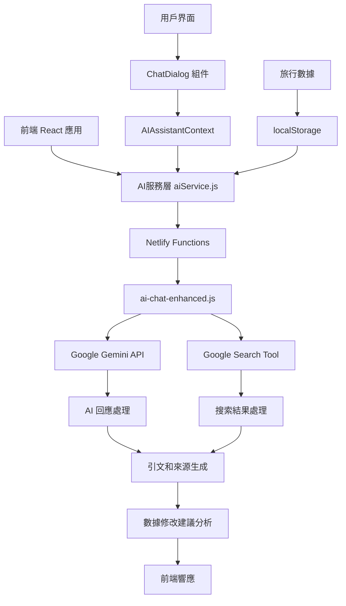
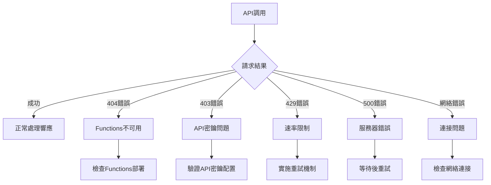
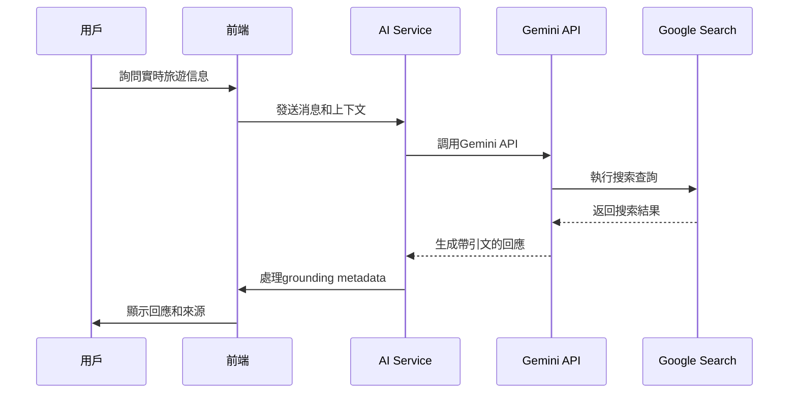
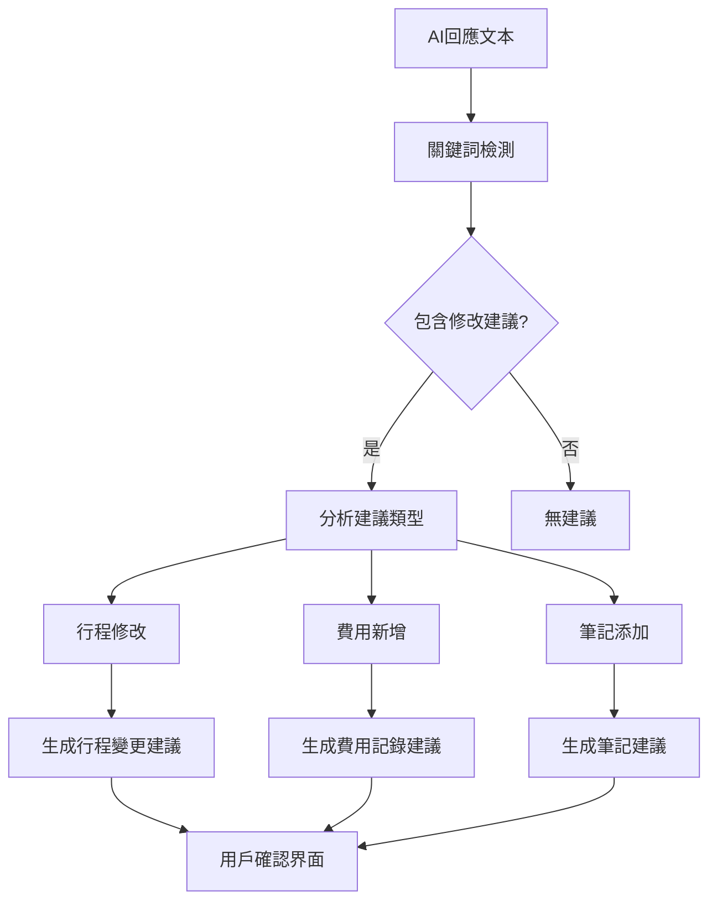

# AI聊天功能修復設計文檔

## 概述

本設計文檔詳細說明了如何修復現有AI聊天功能的404錯誤問題，並優化整個AI助手系統的架構。設計重點在於確保Netlify Functions正確部署、選擇最佳的AI端點版本，以及提供完整的旅行助手功能。

## 系統架構

### 整體架構圖



### 核心組件關係

```mermaid
graph LR
    A[ChatDialog.jsx] --> B[AIAssistantContext]
    B --> C[aiService.js]
    C --> D[/.netlify/functions/ai-chat-enhanced]
    D --> E[Gemini API]
    
    F[錯誤處理] --> G[AIServiceError]
    G --> H[用戶友好錯誤消息]
    
    I[旅行數據上下文] --> J[getCurrentContext]
    J --> C
```

## 技術設計

### 1. Netlify Functions 配置修復

#### 問題分析
當前404錯誤的根本原因：
- Netlify Functions路徑配置可能不正確
- 環境變量GEMINI_API_KEY可能未正確設置
- Functions目錄結構可能不符合Netlify要求

#### 解決方案
1. **路徑標準化**：確保使用標準的`/.netlify/functions/`路徑
2. **配置驗證**：檢查netlify.toml配置文件
3. **環境變量檢查**：驗證GEMINI_API_KEY是否正確設置

### 2. AI端點版本選擇

#### 功能比較分析

| 功能特性 | ai-chat-enhanced.js | ai-chat-enhanced-new.js | ai-chat-enhanced-refactored.js |
|---------|-------------------|------------------------|------------------------------|
| Google Search集成 | ✅ 完整 | ✅ 基本 | ✅ 基本 |
| 引文處理 | ✅ 詳細 | ✅ 簡化 | ✅ 簡化 |
| 來源列表生成 | ✅ 完整 | ❌ 無 | ❌ 無 |
| 前端元數據轉換 | ✅ 完整 | ❌ 無 | ❌ 無 |
| 錯誤處理 | ✅ 全面 | ✅ 基本 | ✅ 基本 |
| 數據修改建議 | ✅ 智能 | ✅ 基本 | ✅ 基本 |

**推薦選擇**：`ai-chat-enhanced.js` - 功能最完整

### 3. 錯誤處理優化

#### 錯誤分類和處理策略



#### 用戶友好錯誤消息映射

| 錯誤類型 | 技術錯誤 | 用戶友好消息 |
|---------|---------|-------------|
| 404 | Functions not found | AI 服務暫時無法使用，請稍後再試 |
| 403 | API key invalid | AI 服務配置問題，請聯繫管理員 |
| 429 | Rate limit exceeded | 請求過於頻繁，請稍後再試 |
| 500 | Server error | AI 服務遇到問題，請稍後再試 |
| Network | Connection failed | 網路連接錯誤，請檢查您的網路連接 |

### 4. AI功能增強

#### Google Search工具集成



#### 旅行數據上下文處理

```javascript
// 上下文數據結構
const travelContext = {
  currentTrip: {
    id: "trip-123",
    destination: "日本東京",
    startDate: "2024-03-15",
    endDate: "2024-03-22"
  },
  expenses: [
    { amount: 1500, category: "住宿", date: "2024-03-15" }
  ],
  notes: [
    { title: "景點推薦", content: "淺草寺值得一去" }
  ],
  packingList: [
    { item: "護照", packed: true }
  ]
}
```

### 5. 數據修改建議系統

#### 智能建議分析流程



#### 建議數據結構

```javascript
const suggestion = {
  id: "change_timestamp_1",
  type: "edit|add|delete",
  category: "trip|expense|note|packing",
  field: "destination|amount|title",
  oldValue: "原始值",
  newValue: "建議新值",
  description: "AI建議說明",
  targetId: "目標對象ID"
}
```

## 部署配置

### Netlify配置優化

#### netlify.toml配置
```toml
[functions]
  directory = "netlify/functions/"

[dev]
  command = "npm run dev"
  targetPort = 5176

[build.environment]
  NODE_VERSION = "18"
```

#### 環境變量設置
- `GEMINI_API_KEY`: Google Gemini API密鑰
- 在Netlify控制台中設置環境變量
- 確保Functions可以訪問環境變量

### Functions部署驗證

#### 部署檢查清單
1. ✅ Functions目錄結構正確
2. ✅ 環境變量已設置
3. ✅ 依賴包正確安裝
4. ✅ 函數在Netlify控制台中可見
5. ✅ 端點可以正常訪問

## 邊界情況和特殊處理

| 情況 | 處理方式 | 代碼位置 |
|------|---------|---------|
| API密鑰無效 | 顯示配置錯誤消息 | aiService.js:85-86 |
| 網絡超時 | 自動重試機制 | aiService.js:132-147 |
| 搜索結果為空 | 返回基本AI回應 | ai-chat-enhanced.js:67-70 |
| 上下文數據過大 | 截斷或壓縮數據 | aiService.js:103-129 |
| 並發請求 | 取消前一個請求 | aiService.js:21-26 |
| 引文格式錯誤 | 安全處理避免崩潰 | ai-chat-enhanced.js:109-153 |