# AI Travel Assistant - 設計文檔

## 概述

本設計文檔描述了AI旅行助手功能的技術架構和實現方案。該功能將在現有的React旅行應用中添加一個全局浮動AI助手，整合Google Gemini API，提供智能對話、數據查閱編輯和旅遊資訊搜索功能。

## 系統架構

### 整體架構圖

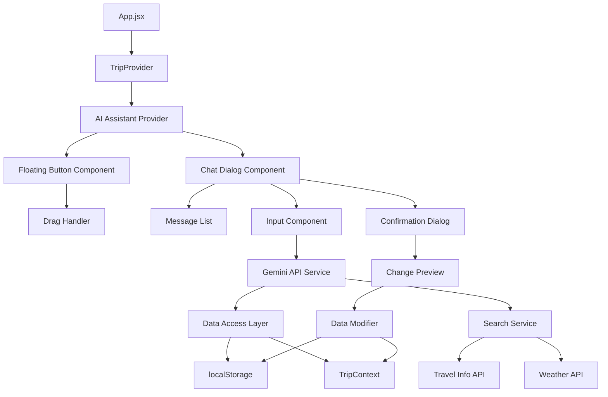

### 核心組件設計

#### 1. AI Assistant Provider

負責管理AI助手的全局狀態和服務：

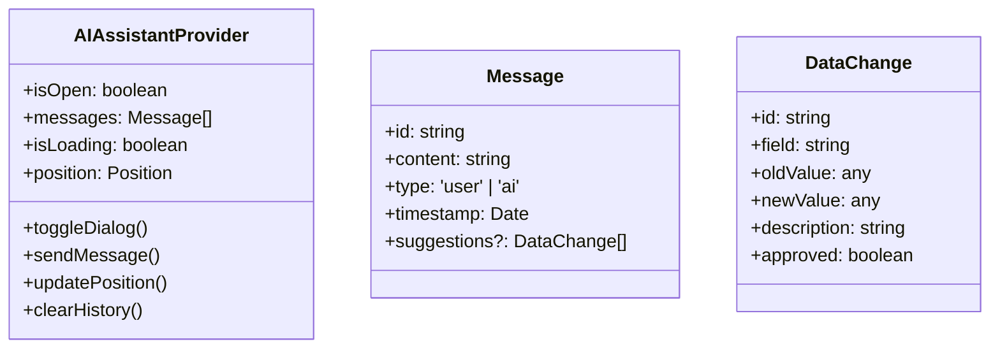

#### 2. 浮動按鈕組件

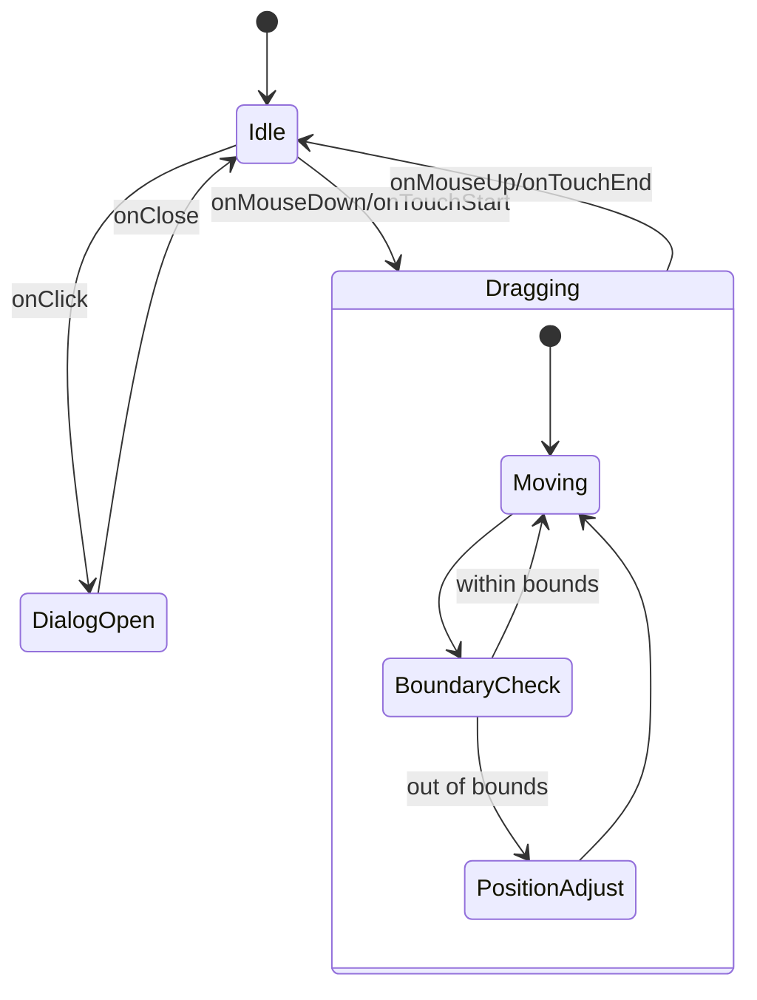

#### 3. 對話框組件架構

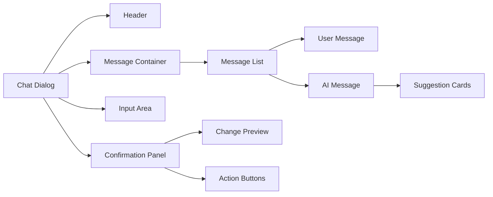

## 數據流設計

### 消息處理流程

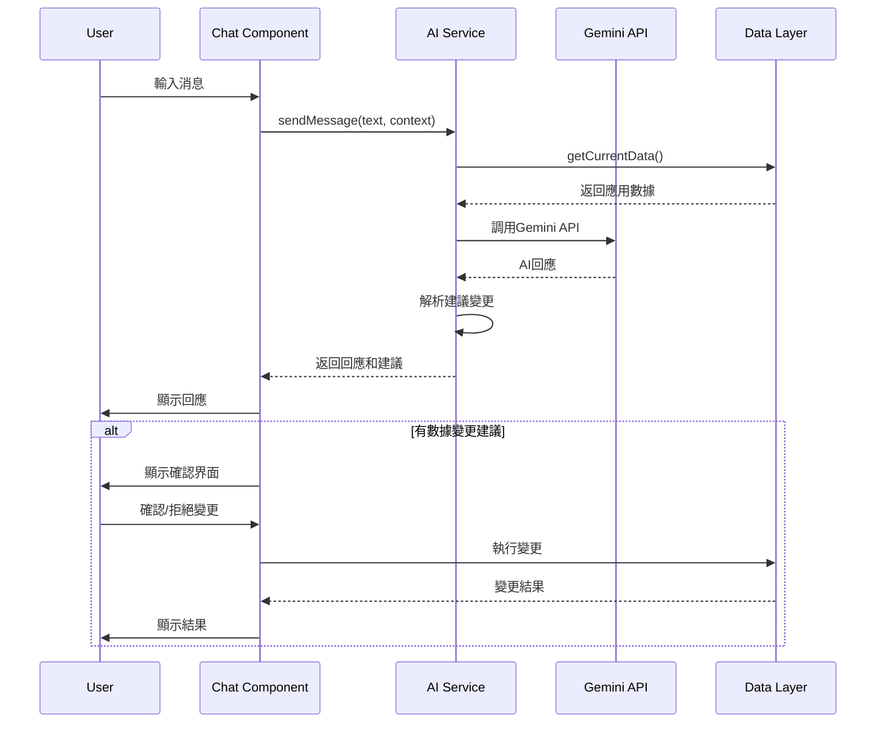

### 數據訪問層設計

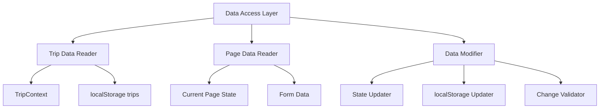

## 技術實現細節

### 1. 浮動按鈕拖拽實現

基於研究結果，使用原生React實現拖拽功能：

- 使用`useRef`獲取DOM元素引用
- 監聽`mousedown`/`touchstart`事件開始拖拽
- 使用`mousemove`/`touchmove`更新位置
- 實現邊界檢測防止按鈕移出視窗
- 支持觸控設備的拖拽操作

### 2. Portal實現全局組件

使用React Portal將浮動組件渲染到body層級：

- 避免z-index衝突問題
- 確保組件在所有頁面元素之上
- 便於全局狀態管理

### 3. Gemini API整合

復用現有的API調用架構：

- 擴展現有的netlify functions
- 創建新的`ai-chat.js` function
- 支持上下文感知的對話
- 實現流式回應處理

### 4. 數據權限管理

設計安全的數據訪問機制：

```javascript
// 數據訪問接口設計
const dataAccessLayer = {
  // 只讀訪問
  getCurrentTripData: () => { /* 返回當前行程數據 */ },
  getCurrentPageData: () => { /* 返回當前頁面數據 */ },
  
  // 變更建議
  suggestChanges: (changes) => { /* 生成變更建議 */ },
  
  // 執行變更（需用戶確認）
  applyChanges: (approvedChanges) => { /* 執行已確認的變更 */ }
};
```

## UI/UX設計

### 1. 視覺設計

- **浮動按鈕**：圓形，對話氣泡圖標，使用主題色彩
- **對話框**：圓角矩形，陰影效果，最大寬度350px
- **消息氣泡**：用戶消息右對齊藍色，AI消息左對齊灰色
- **確認界面**：卡片式設計，清楚標示變更內容

### 2. 響應式設計

```css
/* 移動設備適配 */
@media (max-width: 768px) {
  .chat-dialog {
    width: calc(100vw - 2rem);
    max-height: 60vh;
  }
  
  .floating-button {
    width: 50px;
    height: 50px;
  }
}

/* 平板設備適配 */
@media (min-width: 769px) and (max-width: 1024px) {
  .chat-dialog {
    width: 400px;
    max-height: 70vh;
  }
}
```

### 3. 主題整合

使用現有的styled-components主題系統：

```javascript
const ChatDialog = styled.div`
  background-color: var(--theme-1, #f5f5f5);
  border: 1px solid var(--theme-3, #34495e);
  color: var(--theme-4, #333);
  font-size: var(--font-size-body);
`;
```

## 確認機制設計

### 變更預覽界面

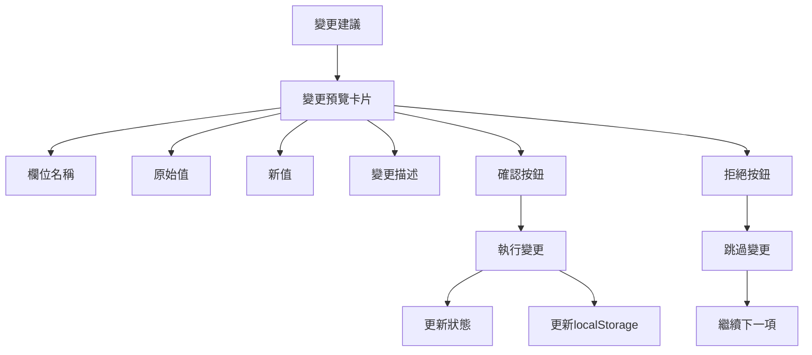

### 批量確認流程

1. **變更分組**：按頁面或數據類型分組
2. **逐項確認**：用戶可以逐一檢視每項變更
3. **批量操作**：提供"全部確認"和"全部拒絕"選項
4. **回滾機制**：支持撤銷已執行的變更

## 性能優化

### 1. 記憶體管理

- 對話歷史限制在100條消息
- 定期清理未使用的組件狀態
- 使用React.memo優化重渲染

### 2. API調用優化

- 實現請求去重避免重複調用
- 添加請求超時處理
- 使用AbortController取消未完成的請求

### 3. 數據緩存

- 緩存常用的數據查詢結果
- 實現智能緩存失效機制
- 使用localStorage持久化對話歷史

## 錯誤處理

### 錯誤類型與處理策略

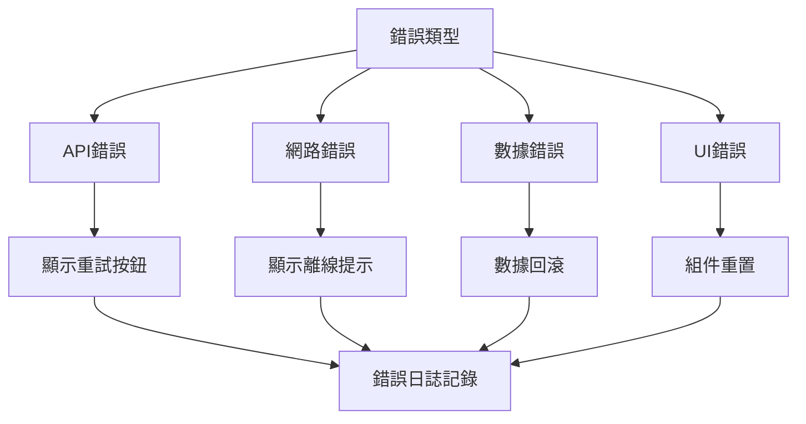

## 安全考量

### 1. 數據訪問控制

- 限制AI只能訪問當前用戶的數據
- 實現數據訪問日誌記錄
- 敏感數據脫敏處理

### 2. API安全

- 使用環境變數保護API密鑰
- 實現請求頻率限制
- 添加請求驗證機制

### 3. 用戶隱私

- 對話數據本地存儲
- 不向服務器發送敏感個人資訊
- 提供數據清除功能

## 擴展性設計

### 未來功能擴展點

1. **多語言支持**：國際化框架準備
2. **語音交互**：語音輸入輸出接口
3. **圖片分析**：圖片上傳和分析功能
4. **離線模式**：本地AI模型整合
5. **個性化**：用戶偏好學習機制

### 插件架構

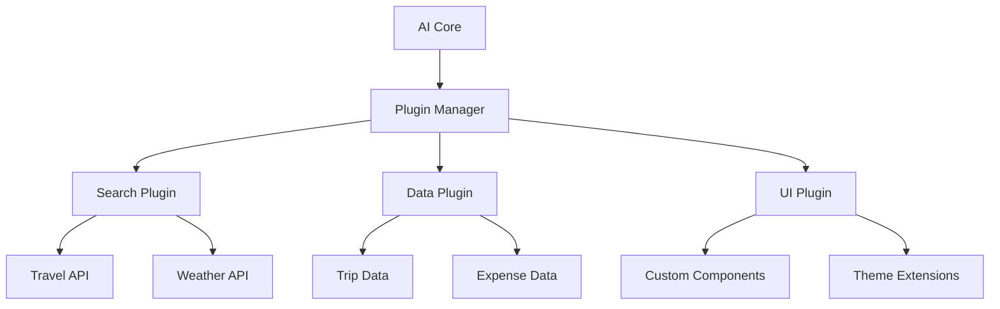

這個設計確保了系統的可維護性、可擴展性和用戶體驗的一致性，同時為未來的功能擴展提供了堅實的基礎。# AI旅遊助手浮動按鈕設計文檔

## 概述

本設計文檔描述了AI旅遊助手浮動按鈕功能的技術實現方案。該功能將在現有React旅遊應用程式中添加一個全局可訪問的AI助手，整合Google Gemini API，提供智能對話、數據讀取修改和旅遊資訊搜索服務。

## 系統架構

### 高層架構圖

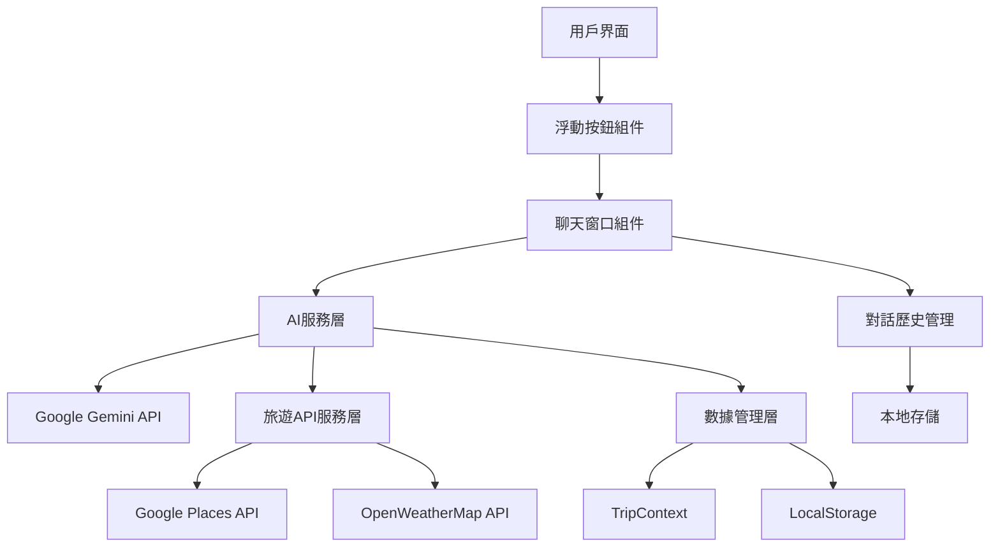

### 核心組件設計

#### 1. FloatingAIButton 組件

**職責：** 全局浮動按鈕的渲染和拖拽功能

**技術實現：**
- 使用React Portal渲染到document.body，確保全局可見性
- 實現拖拽功能使用mouse事件監聽和position: fixed定位
- 位置狀態持久化到localStorage
- z-index設置為9999確保在最上層

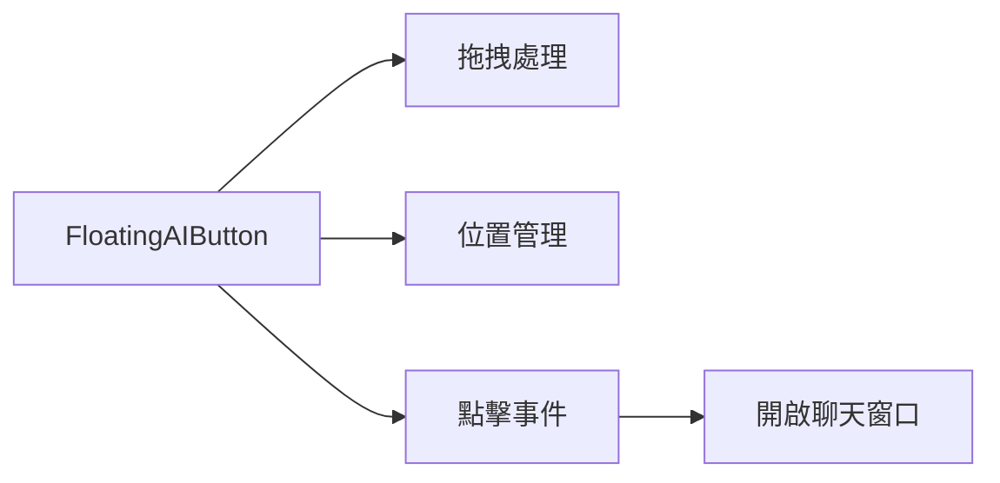

#### 2. ChatWindow 組件

**職責：** 聊天界面的渲染和用戶交互管理

**技術實現：**
- 響應式設計，支持桌面和移動設備
- 訊息列表虛擬化處理大量對話歷史
- 自動滾動到最新訊息
- 支持Markdown渲染AI回應

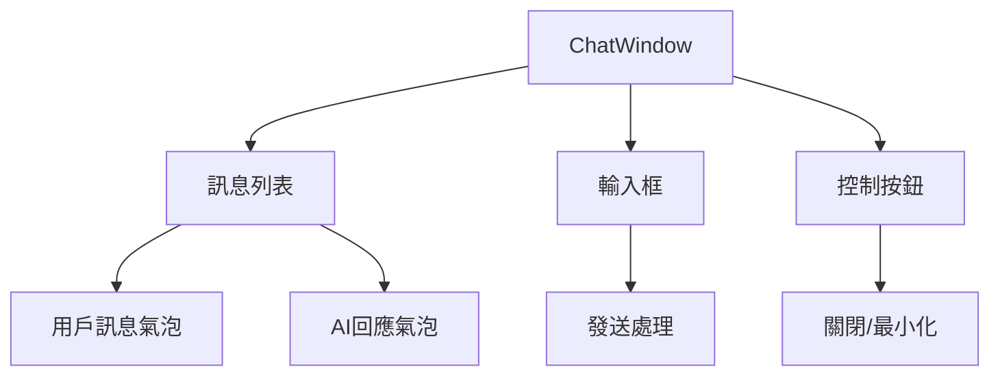

#### 3. AIService 服務層

**職責：** AI對話和API整合的核心邏輯

**技術實現：**
- Google Gemini API整合，支持流式回應 <kreference link="https://ai.google.dev/api" index="1">[^1]</kreference>
- 對話歷史管理，維護context格式
- 錯誤處理和重試機制
- API密鑰安全管理

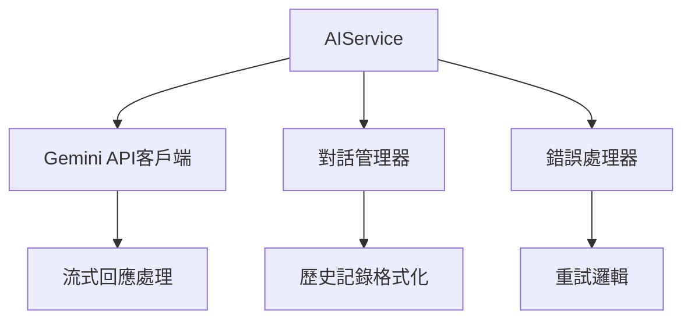

## 數據流設計

### 對話流程

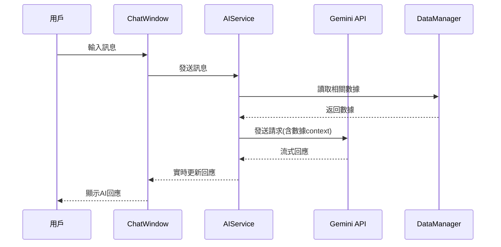

### 數據修改流程

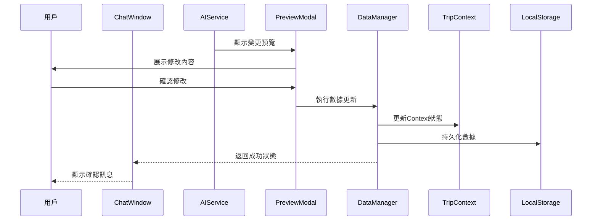

## 技術實現細節

### 1. 全局狀態管理

**AI助手狀態：**
```javascript
const AIAssistantContext = {
  isOpen: boolean,
  position: { x: number, y: number },
  chatHistory: Message[],
  isLoading: boolean,
  error: string | null,
  temperature: number // AI創意度設定 (0.0-1.0)
}
```

**整合現有TripContext：**
- 擴展現有TripContext以包含AI助手狀態
- 保持向後兼容性
- 利用現有的trips、fontSizes等狀態
- 在Settings頁面添加AI創意度滑桿控制

### 2. API整合架構

**Gemini API整合：**
```javascript
// 利用現有的Netlify Functions架構
class GeminiService {
  constructor() {
    // 使用現有的analyze-itinerary.js和categorize-expense.js模式
    this.apiBaseUrl = import.meta.env.VITE_API_BASE_URL || '';
  }
  
  async sendMessage(message, context, history, temperature = 0.7) {
    // 調用現有的Netlify function或創建新的chat function
    const response = await fetch(`${this.apiBaseUrl}/.netlify/functions/ai-chat`, {
      method: 'POST',
      headers: { 'Content-Type': 'application/json' },
      body: JSON.stringify({
        message,
        context: this.formatContext(context),
        history: this.formatHistory(history),
        temperature // AI創意度參數
      })
    });
    
    return await response.json();
  }
  
  formatContext(tripData) {
    // 格式化現有的TripContext數據供AI理解
    return {
      currentTrip: tripData.selectedTrip,
      allTrips: tripData.trips,
      expenses: tripData.expenses,
      notes: tripData.notes
    };
  }
}
```

**旅遊API服務：**
```javascript
class TravelAPIService {
  async searchPlaces(query, location) {
    // Google Places API整合
  }
  
  async getWeather(location, date) {
    // OpenWeatherMap API整合
  }
  
  async getTransportation(from, to, date) {
    // 交通API整合
  }
}
```

### 3. 數據訪問層設計

**DataManager類：**
```javascript
class DataManager {
  constructor(tripContext) {
    this.tripContext = tripContext;
  }
  
  getAllTripData() {
    return {
      trips: this.tripContext.trips,
      selectedTrip: this.getSelectedTrip(),
      expenses: this.getExpenses(),
      packingLists: this.getPackingLists(),
      notes: this.getNotes()
    };
  }
  
  async updateTripData(updates) {
    // 實施預覽和確認機制
    const preview = this.generatePreview(updates);
    const confirmed = await this.showPreview(preview);
    
    if (confirmed) {
      this.applyUpdates(updates);
      this.persistToStorage();
      this.updateContext();
    }
  }
}
```

### 4. 用戶界面設計

**響應式聊天窗口：**
```css
.chat-window {
  position: fixed;
  width: 350px;
  height: 500px;
  max-width: 90vw;
  max-height: 80vh;
  z-index: 9998;
  
  @media (max-width: 768px) {
    width: 95vw;
    height: 70vh;
  }
}
```

**拖拽實現：**
```javascript
const useDraggable = (elementRef) => {
  const [position, setPosition] = useState({ x: 20, y: 20 });
  const [isDragging, setIsDragging] = useState(false);
  
  useEffect(() => {
    const handleMouseMove = (e) => {
      if (!isDragging) return;
      
      const newX = Math.max(0, Math.min(window.innerWidth - 60, e.clientX - 30));
      const newY = Math.max(0, Math.min(window.innerHeight - 60, e.clientY - 30));
      
      setPosition({ x: newX, y: newY });
    };
    
    // 事件監聽器設置
  }, [isDragging]);
  
  return { position, setIsDragging };
};
```

## 安全性考慮

### API密鑰管理
- 利用現有的Netlify Functions中的GEMINI_API_KEY環境變數
- 擴展現有的analyze-itinerary.js架構創建新的ai-chat function
- 實施請求頻率限制和錯誤處理

### 數據隱私
- 對話歷史僅存儲在本地
- 敏感數據在發送前進行脫敏處理
- 提供清除歷史記錄功能

### 錯誤處理
- 網路錯誤的優雅降級
- API配額超限的友善提示
- 數據修改失敗的回滾機制

## 性能優化

### 1. 懶加載策略
- AI組件按需載入
- 聊天歷史分頁載入
- API響應緩存機制

### 2. 記憶體管理
- 對話歷史智能截斷
- 組件卸載時清理事件監聽器
- 圖片和媒體內容的延遲載入

### 3. 網路優化
- API請求去重
- 響應數據壓縮
- 離線狀態檢測和處理

## 邊界情況處理

| 情況 | 處理方式 | 代碼模組位置 |
|------|----------|-------------|
| API密鑰無效 | 顯示配置錯誤提示，提供設定連結 | AIService.js |
| 網路連接中斷 | 顯示離線狀態，啟用重試機制 | NetworkManager.js |
| 對話歷史過長 | 自動截斷舊記錄，保留重要context | ChatHistoryManager.js |
| 數據修改衝突 | 檢測衝突，提供合併選項 | DataManager.js |
| 瀏覽器不支持 | 降級到基本功能，隱藏高級特性 | FeatureDetector.js |
| 螢幕尺寸過小 | 調整界面佈局，簡化功能 | ResponsiveManager.js |
| API配額超限 | 顯示限制提示，建議稍後重試 | QuotaManager.js |
| 數據格式錯誤 | 數據驗證和修復，錯誤日誌記錄 | DataValidator.js |
| 創意度設定異常 | 重置為預設值0.7，顯示警告訊息 | SettingsManager.js |

## AI創意度設定界面

### 設定頁面整合設計

**創意度滑桿組件：**
```javascript
const AICreativitySlider = () => {
  const { aiTemperature, setAiTemperature } = useTrip();
  
  const getCreativityLabel = (value) => {
    if (value <= 0.3) return "保守準確";
    if (value <= 0.7) return "平衡實用";
    return "創意發想";
  };
  
  return (
    <SliderContainer>
      <Label>AI創意度</Label>
      <Slider
        min={0}
        max={1}
        step={0.1}
        value={aiTemperature}
        onChange={setAiTemperature}
      />
      <Description>{getCreativityLabel(aiTemperature)}</Description>
    </SliderContainer>
  );
};
```

**TripContext擴展：**
```javascript
// 在現有TripContext中添加
const [aiTemperature, setAiTemperature] = useState(() => {
  const saved = localStorage.getItem('aiTemperature');
  return saved ? parseFloat(saved) : 0.7; // 預設值
});

useEffect(() => {
  localStorage.setItem('aiTemperature', aiTemperature.toString());
}, [aiTemperature]);
```

[^1]: https://ai.google.dev/api