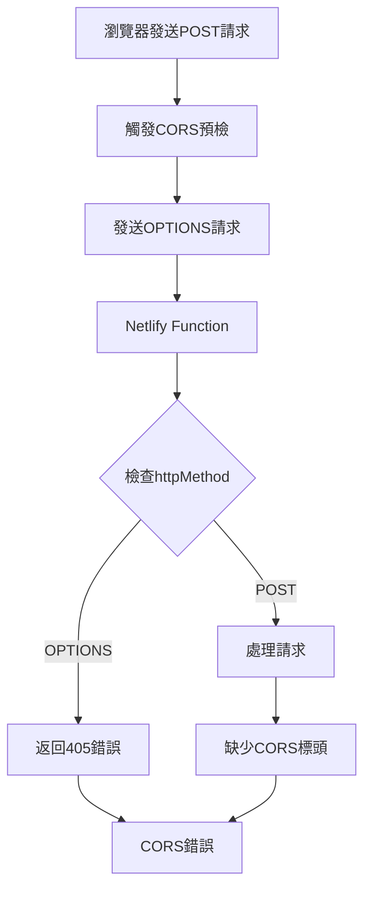
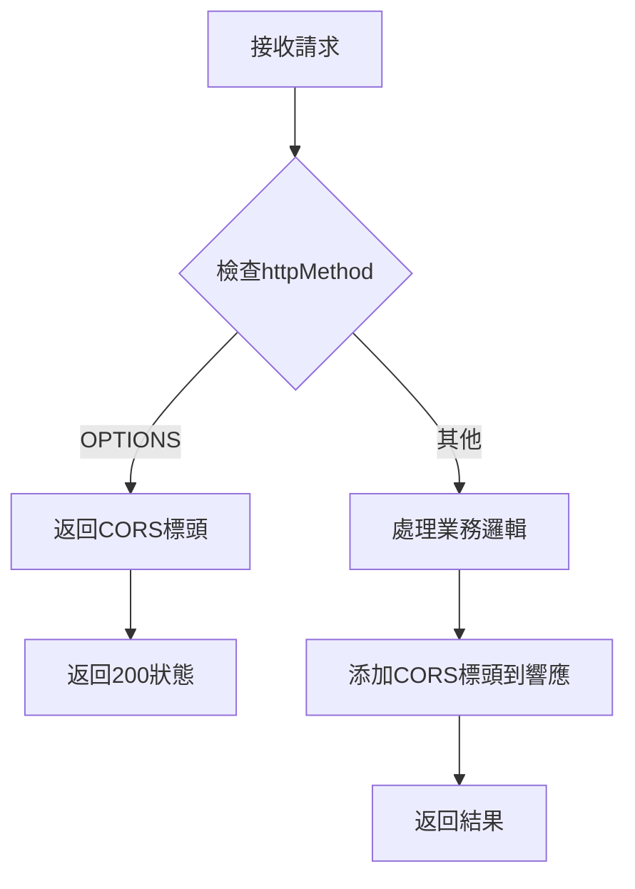

# CORS修復設計文檔

## 概述

本設計文檔詳細說明如何修復AI Travel App中的CORS錯誤，確保前端應用程序能夠成功與Netlify Functions通信。解決方案包括修復OPTIONS預檢請求處理、統一端口配置、改進CORS標頭管理等。

## 問題分析

### 當前問題

1. **OPTIONS預檢請求失敗**：Netlify Functions返回405 Method Not Allowed錯誤 <kreference link="https://answers.netlify.com/t/handling-cors-preflight-requests/42724" index="1">[^1]</kreference>
2. **端口配置不一致**：前端實際運行在5177端口，但配置為5175端口
3. **CORS標頭缺失**：響應中缺少必要的Access-Control-Allow-*標頭
4. **錯誤處理不完整**：錯誤響應中也缺少CORS標頭

### 根本原因



## 解決方案設計

### 1. Netlify Functions CORS處理改進

#### 1.1 統一CORS標頭配置

```javascript
const CORS_HEADERS = {
  'Access-Control-Allow-Origin': '*',
  'Access-Control-Allow-Headers': 'Content-Type, Authorization',
  'Access-Control-Allow-Methods': 'GET, POST, PUT, DELETE, OPTIONS',
  'Access-Control-Max-Age': '86400'
};
```

#### 1.2 OPTIONS請求處理邏輯



#### 1.3 錯誤處理改進

所有錯誤響應都必須包含CORS標頭，確保前端能夠接收到錯誤信息。

### 2. 端口配置統一

#### 2.1 配置文件修正

| 文件 | 當前配置 | 目標配置 | 說明 |
|------|----------|----------|------|
| vite.config.js | port: 5175 | port: 5175 | 保持不變 |
| netlify.toml | targetPort = 5173 | targetPort = 5175 | 修正為匹配Vite |
| package.json | --target-port 5175 | --target-port 5175 | 保持不變 |

#### 2.2 環境變量配置

```bash
VITE_API_BASE_URL=http://localhost:8888
GEMINI_API_KEY=<實際API密鑰>
```

### 3. 開發環境優化

#### 3.1 Vite代理配置（可選方案）

如果直接修復Functions不夠穩定，可以考慮添加Vite代理： <kreference link="https://rubenr.dev/cors-vite-vue/" index="2">[^2]</kreference>

```javascript
export default defineConfig({
  plugins: [react()],
  server: {
    port: 5175,
    host: true,
    proxy: {
      '/.netlify/functions': {
        target: 'http://localhost:8888',
        changeOrigin: true,
        secure: false
      }
    }
  }
})
```

#### 3.2 並發啟動優化

確保`npm run dev`命令能夠正確啟動兩個服務：
- Vite開發服務器（端口5175）
- Netlify Dev服務器（端口8888）

### 4. 函數修改策略

#### 4.1 ai-chat-enhanced.js修改

```javascript
export const handler = async (event) => {
  // 處理OPTIONS預檢請求
  if (event.httpMethod === 'OPTIONS') {
    return {
      statusCode: 200,
      headers: CORS_HEADERS,
      body: ''
    };
  }

  try {
    // 業務邏輯處理
    const result = await processRequest(event);
    
    return {
      statusCode: 200,
      headers: {
        'Content-Type': 'application/json',
        ...CORS_HEADERS
      },
      body: JSON.stringify(result)
    };
  } catch (error) {
    return {
      statusCode: 500,
      headers: {
        'Content-Type': 'application/json',
        ...CORS_HEADERS
      },
      body: JSON.stringify({ error: error.message })
    };
  }
};
```

#### 4.2 其他Functions統一處理

創建共用的CORS處理函數，確保所有Functions都使用相同的CORS邏輯。

### 5. 測試和驗證

#### 5.1 自動化測試腳本

```bash
# 測試OPTIONS請求
curl -X OPTIONS http://localhost:8888/.netlify/functions/ai-chat-enhanced -v

# 測試POST請求
curl -X POST http://localhost:8888/.netlify/functions/ai-chat-enhanced \
  -H "Content-Type: application/json" \
  -d '{"message":"test","context":{}}' -v
```

#### 5.2 瀏覽器測試

在瀏覽器控制台中執行：
```javascript
fetch('http://localhost:8888/.netlify/functions/ai-chat-enhanced', {
  method: 'POST',
  headers: { 'Content-Type': 'application/json' },
  body: JSON.stringify({ message: 'test', context: {} })
})
.then(response => response.json())
.then(console.log)
.catch(console.error);
```

## 實施計劃

### 階段1：配置修正
1. 修正netlify.toml中的targetPort配置
2. 驗證所有端口配置的一致性
3. 重啟開發服務器測試

### 階段2：Functions修改
1. 修改ai-chat-enhanced.js添加OPTIONS處理
2. 統一所有響應的CORS標頭
3. 測試OPTIONS和POST請求

### 階段3：錯誤處理改進
1. 確保所有錯誤響應包含CORS標頭
2. 改進錯誤消息的用戶友好性
3. 添加調試信息

### 階段4：測試和文檔
1. 執行全面的CORS測試
2. 更新開發文檔
3. 創建故障排除指南

## 風險和緩解措施

| 風險 | 影響 | 緩解措施 |
|------|------|----------|
| 配置更改破壞現有功能 | 高 | 逐步修改，每步都進行測試 |
| 生產環境CORS問題 | 中 | 在staging環境充分測試 |
| 性能影響 | 低 | CORS處理開銷很小 |

## 成功標準

1. ✅ OPTIONS請求返回200狀態碼和正確的CORS標頭
2. ✅ POST請求成功完成，無CORS錯誤
3. ✅ 所有端口配置保持一致
4. ✅ 錯誤響應也包含CORS標頭
5. ✅ 開發環境穩定運行

  [^1]: https://answers.netlify.com/t/handling-cors-preflight-requests/42724
  [^2]: https://rubenr.dev/cors-vite-vue/