# Gemini Google Search 工具整合設計文檔

## 概述

本設計文檔描述了如何將 Google Gemini API 的 Google Search 工具整合到現有的 AI 旅行助手系統中。整合將包括 API 配置、groundingMetadata 處理、引文生成系統，以及前端顯示功能的完整實作。

## 系統架構

### 整體架構圖

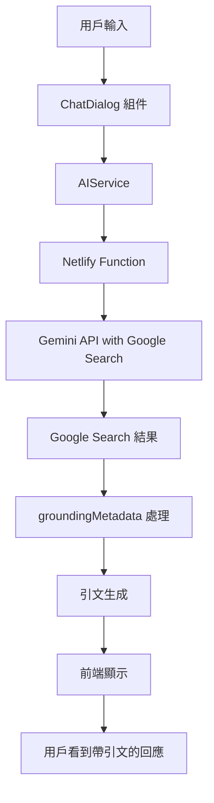

### 核心組件關係

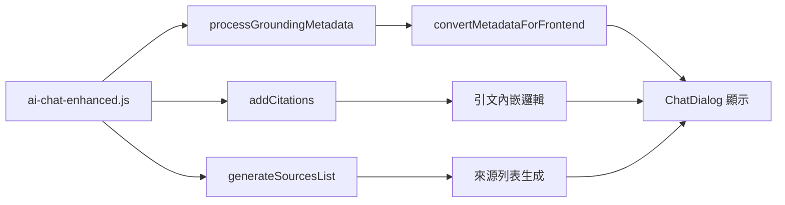

## 詳細設計

### 1. Gemini API 配置模組

#### Google Search 工具配置
```javascript
const googleSearchTool = {
  googleSearch: {}
};

const modelConfig = {
  model: "gemini-2.0-flash",
  tools: [googleSearchTool]
};
```

#### API 調用流程
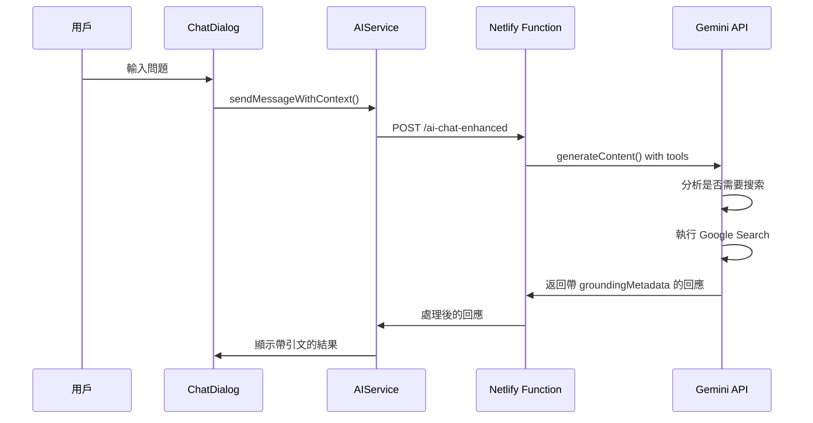

### 2. groundingMetadata 處理系統

#### 數據結構定義
```typescript
interface GroundingMetadata {
  webSearchQueries: string[];
  groundingChunks: GroundingChunk[];
  groundingSupports: GroundingSupport[];
  searchEntryPoint?: SearchEntryPoint;
}

interface GroundingChunk {
  web: {
    uri: string;
    title: string;
  };
}

interface GroundingSupport {
  segment: {
    startIndex: number;
    endIndex: number;
    text: string;
  };
  groundingChunkIndices: number[];
}
```

#### 處理流程
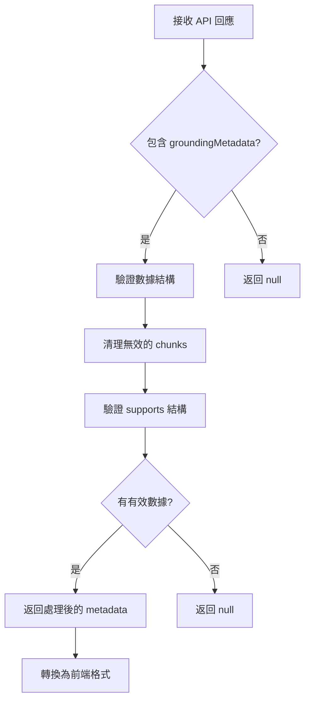

### 3. 引文生成系統

#### 引文插入算法
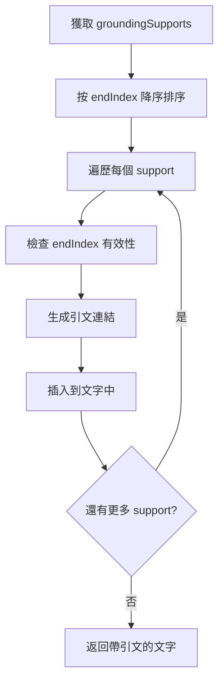

#### 引文格式規範
- 內嵌引文：`[編號](URL "標題")`
- 多個來源：`[1](url1), [2](url2)`
- 來源列表：編號 + 標題 + 域名

### 4. 前端顯示系統

#### ChatDialog 組件更新
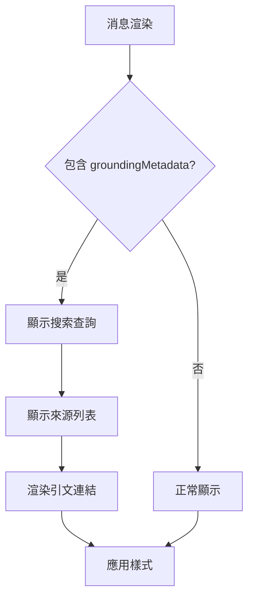

#### 引文樣式設計
- 引文連結：藍色、可點擊、hover 效果
- 搜索元數據：淺藍背景、小字體
- 來源列表：編號圓圈 + 連結 + 域名

### 5. 錯誤處理機制

#### 錯誤處理流程
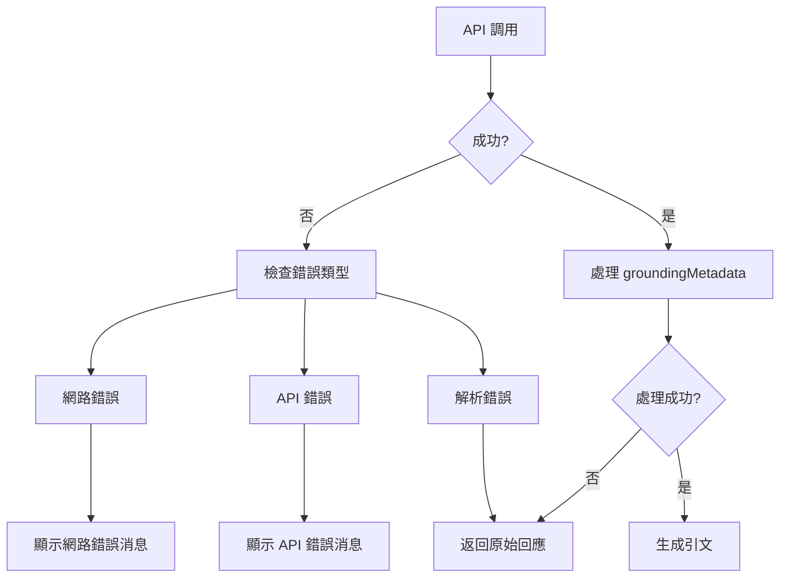

### 6. 性能優化策略

#### 處理優化
- 使用 AbortController 取消重複請求
- 快取 groundingMetadata 處理結果
- 延遲載入來源列表
- 優化引文插入算法

#### 記憶體管理
- 限制消息歷史數量（100條）
- 清理無效的 metadata 引用
- 避免深度複製大型對象

## 邊界情況和特殊處理

| 情況 | 處理方式 | 代碼位置 |
|------|----------|----------|
| groundingMetadata 為空 | 返回原始文字，不顯示引文 | processGroundingMetadata() |
| groundingChunks 無效 | 過濾無效項目，繼續處理 | processGroundingMetadata() |
| endIndex 超出文字長度 | 使用 Math.min() 限制範圍 | addCitations() |
| 引文索引超出範圍 | 跳過該引文，記錄警告 | addCitations() |
| API 調用失敗 | 顯示錯誤消息，提供重試 | handler() |
| 網路連接問題 | 優雅降級，顯示離線提示 | AIService |
| 解析 JSON 失敗 | 返回預設錯誤回應 | handler() |
| 引文連結無效 | 顯示文字但不可點擊 | ChatDialog |

## 模組間接口定義

### AIService 接口
```javascript
// 發送帶上下文的消息
async sendMessageWithContext(message: string): Promise<{
  content: string;
  suggestions: any[];
  groundingMetadata: GroundingMetadata | null;
}>
```

### Netlify Function 接口
```javascript
// 處理 AI 聊天請求
export const handler = async (event) => {
  // 返回格式
  return {
    statusCode: 200,
    body: JSON.stringify({
      response: string,
      suggestions: any[],
      groundingMetadata: FrontendMetadata | null,
      metadata: {
        timestamp: string,
        model: string,
        hasGrounding: boolean,
        searchQueries: string[]
      }
    })
  };
}
```

### ChatDialog 組件接口
```javascript
// 消息對象結構
interface Message {
  id: string;
  content: string;
  type: 'user' | 'ai' | 'system';
  timestamp: Date;
  suggestions?: any[];
  groundingMetadata?: FrontendMetadata;
}
```# Design Document

## Overview

本設計文檔描述了如何將現有的 AI 旅行助手搜索功能完全重構，使用 Gemini API 內建的 Google Search 工具來替代現有的自定義搜索服務。這個重構將簡化系統架構，提升搜索準確性，並增加資訊來源的可信度。

## Architecture Overview

### Current Architecture

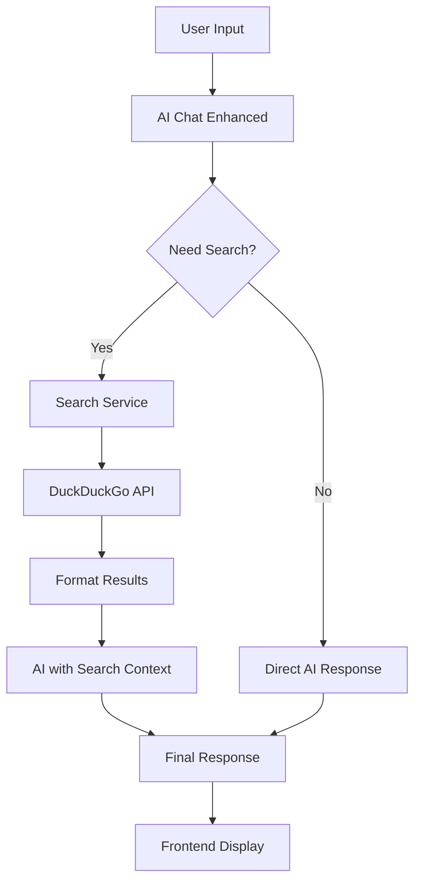

### New Architecture

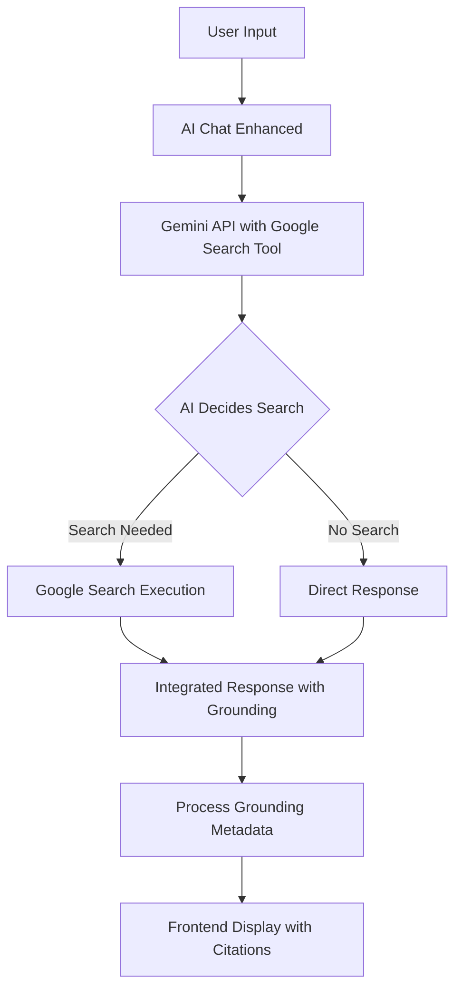

## Core Components Design

### 1. AI Service Layer Redesign

#### Current Implementation Issues
- 複雜的搜索觸發邏輯
- 多次 API 調用
- 手動結果整合

#### New Implementation
```javascript
// 簡化的 AI 服務配置
const groundingTool = {
  googleSearch: {}
};

const config = {
  tools: [groundingTool]
};
```

### 2. Response Processing Pipeline

#### Grounding Metadata Structure
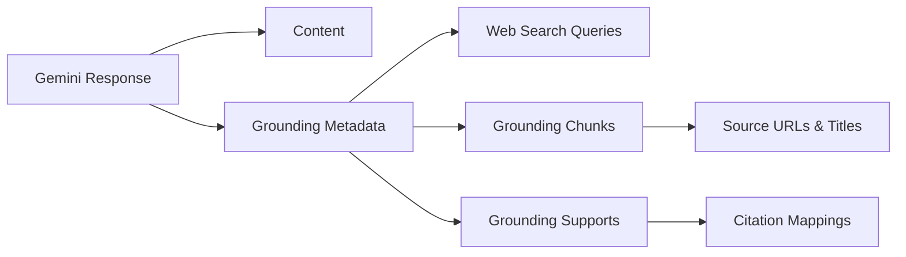

#### Data Flow
1. **Input Processing**: 用戶輸入直接傳送到 Gemini API
2. **AI Decision**: Gemini 自動判斷是否需要搜索
3. **Search Execution**: 如需要，自動執行 Google Search
4. **Response Generation**: 整合搜索結果生成回應
5. **Metadata Processing**: 處理引文和來源資訊
6. **Frontend Display**: 顯示回應和引文

### 3. Citation Display System

#### Citation Processing Logic
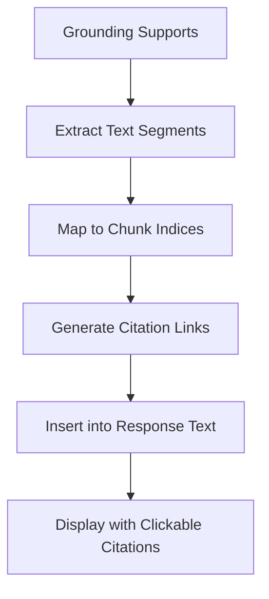

#### Citation Format
- **Inline Citations**: `[1](source-url), [2](source-url)`
- **Source List**: 在回應末尾顯示完整來源列表
- **Hover Information**: 滑鼠懸停顯示來源標題

### 4. Error Handling and Fallback

#### Error Scenarios
1. **Google Search Unavailable**: 使用 AI 內建知識
2. **API Rate Limiting**: 提供適當的錯誤訊息
3. **Network Issues**: 降級到基本 AI 功能

#### Fallback Strategy
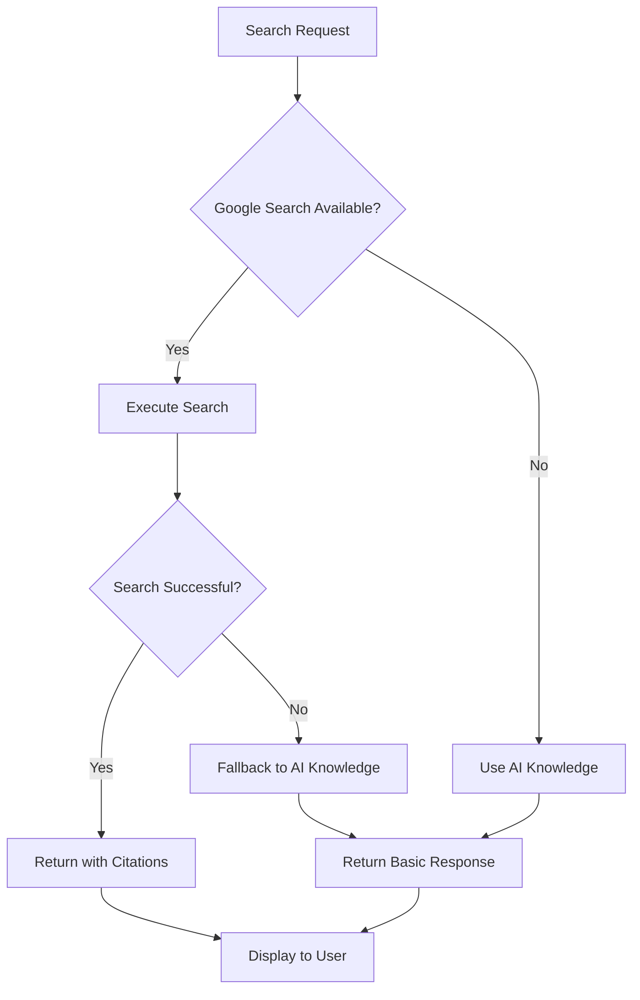

## Implementation Strategy

### Phase 1: Core Integration
1. **API Configuration**: 設置 Gemini Google Search 工具
2. **Basic Response Handling**: 處理基本的搜索回應
3. **Error Handling**: 實作基本的錯誤處理機制

### Phase 2: Citation System
1. **Metadata Processing**: 解析 groundingMetadata
2. **Citation Generation**: 生成內嵌引文
3. **Frontend Display**: 實作引文顯示 UI

### Phase 3: Legacy Removal
1. **Code Cleanup**: 移除舊的搜索服務代碼
2. **Testing**: 確保所有功能正常運作
3. **Performance Optimization**: 優化新實作的性能

### Phase 4: Enhancement
1. **Cost Monitoring**: 實作使用量監控
2. **Advanced Features**: 添加進階搜索功能
3. **User Experience**: 優化用戶體驗

## Data Models

### Request Format
```javascript
{
  model: "gemini-2.5-flash",
  contents: "用戶查詢",
  config: {
    tools: [{
      googleSearch: {}
    }]
  }
}
```

### Response Format
```javascript
{
  text: "AI 回應內容",
  candidates: [{
    content: { /* 回應內容 */ },
    groundingMetadata: {
      webSearchQueries: ["查詢1", "查詢2"],
      groundingChunks: [
        {
          web: {
            uri: "https://example.com",
            title: "來源標題"
          }
        }
      ],
      groundingSupports: [
        {
          segment: {
            startIndex: 0,
            endIndex: 50,
            text: "引用的文字片段"
          },
          groundingChunkIndices: [0]
        }
      ]
    }
  }]
}
```

## Security and Performance Considerations

### Security
- **API Key Protection**: 確保 Gemini API 金鑰安全
- **Input Validation**: 驗證用戶輸入防止濫用
- **Rate Limiting**: 實作適當的頻率限制

### Performance
- **Response Caching**: 考慮實作回應快取機制
- **Request Optimization**: 優化 API 請求參數
- **Error Recovery**: 快速錯誤恢復機制

### Cost Management
- **Usage Monitoring**: 監控 Google Search 工具使用量
- **Budget Alerts**: 設置成本警告機制
- **Usage Analytics**: 分析搜索使用模式

## Integration Points

### Frontend Integration
- **ChatDialog Component**: 更新以顯示引文
- **Message Display**: 支援新的回應格式
- **Error Handling**: 處理新的錯誤類型

### Backend Integration
- **AI Service**: 重構 AI 服務層
- **Response Processing**: 新的回應處理邏輯
- **Logging**: 更新日誌記錄機制

## Testing Strategy

### Unit Testing
- **API Integration**: 測試 Gemini API 整合
- **Citation Processing**: 測試引文生成邏輯
- **Error Handling**: 測試各種錯誤情況

### Integration Testing
- **End-to-End Flow**: 測試完整的搜索流程
- **Frontend Integration**: 測試前端顯示邏輯
- **Performance Testing**: 測試回應時間和性能

### User Acceptance Testing
- **Search Accuracy**: 驗證搜索結果準確性
- **Citation Functionality**: 測試引文功能
- **User Experience**: 評估整體用戶體驗

## Migration Plan

### Pre-Migration
1. **Backup Current System**: 備份現有代碼
2. **Feature Flag Setup**: 設置功能開關
3. **Testing Environment**: 準備測試環境

### Migration Steps
1. **Parallel Implementation**: 並行實作新功能
2. **Gradual Rollout**: 逐步推出新功能
3. **Monitor and Adjust**: 監控並調整
4. **Legacy Cleanup**: 清理舊代碼

### Post-Migration
1. **Performance Monitoring**: 監控性能指標
2. **User Feedback**: 收集用戶反饋
3. **Continuous Improvement**: 持續改進