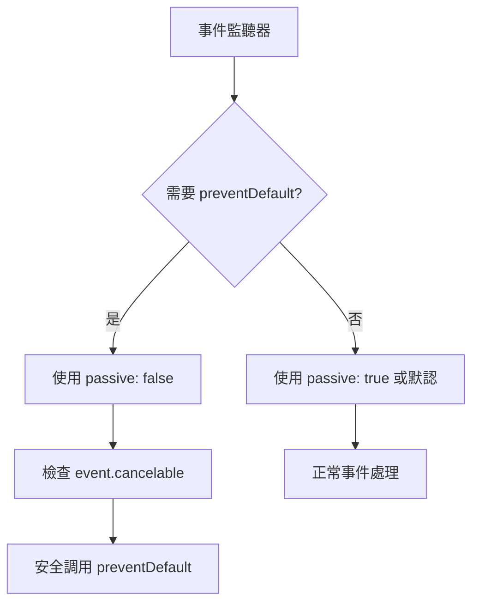
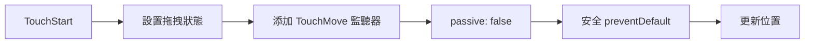

# Design Document

## Overview

本設計文檔描述了解決 "Unable to preventDefault inside passive event listener invocation" 錯誤的技術方案。該錯誤主要出現在 React 應用的觸摸事件處理中，特別是在 FloatingButton 和 TripManagement 組件中。

## Problem Analysis

### Root Cause

錯誤的根本原因是瀏覽器為了提升滾動性能，將某些觸摸事件（如 touchstart、touchmove）默認設置為 passive 模式。在 passive 事件監聽器中調用 preventDefault() 會被瀏覽器忽略並產生警告 <kreference link="https://stackoverflow.com/questions/42101723/unable-to-preventdefault-inside-passive-event-listener" index="1">[^1]</kreference>。

### Affected Components

通過代碼分析發現以下組件存在問題：

1. **FloatingButton.jsx** - 第 167 行：`document.addEventListener('touchmove', handleTouchMove, { passive: false })`
2. **TripManagement.jsx** - 第 358-361 行：觸摸事件監聽器設置為 `{ passive: true }`，但在處理函數中可能調用 preventDefault()

## Solution Architecture

### 1. 事件監聽器策略



### 2. CSS Touch-Action 策略

對於不需要複雜 JavaScript 控制的場景，優先使用 CSS touch-action 屬性：

```css
.draggable-element {
  touch-action: none; /* 完全禁用觸摸手勢 */
}

.scrollable-container {
  touch-action: pan-y; /* 只允許垂直滾動 */
}
```

## Technical Implementation

### 1. FloatingButton 組件修復

**問題分析：**
- 當前在拖拽時使用 `{ passive: false }` 是正確的
- 但需要確保 preventDefault() 調用是安全的

**解決方案：**
```javascript
const handleTouchMove = (e) => {
  if (e.cancelable) {
    e.preventDefault();
  }
  const touch = e.touches[0];
  handleDragMove(touch.clientX, touch.clientY);
};
```

### 2. TripManagement 組件修復

**問題分析：**
- 當前觸摸事件設置為 `{ passive: true }`
- 但在某些處理函數中可能需要阻止默認行為

**解決方案：**
```javascript
// 對於需要 preventDefault 的事件，使用 passive: false
container.addEventListener('touchmove', handleTouchMove, { passive: false });

// 在處理函數中安全調用 preventDefault
const handleTouchMove = (e) => {
  if (isDragging && e.cancelable) {
    e.preventDefault();
  }
  // 其他處理邏輯...
};
```

### 3. 通用事件處理工具函數

創建通用的事件處理工具函數：

```javascript
// utils/eventUtils.js
export const safePreventDefault = (event) => {
  if (event.cancelable) {
    event.preventDefault();
  }
};

export const addTouchEventListener = (element, eventType, handler, needsPreventDefault = false) => {
  const options = needsPreventDefault ? { passive: false } : { passive: true };
  element.addEventListener(eventType, handler, options);
};
```

## Component-Specific Solutions

### FloatingButton.jsx



**修復步驟：**
1. 在 handleTouchMove 中添加 cancelable 檢查
2. 確保只在必要時調用 preventDefault
3. 添加適當的 CSS touch-action 屬性

### TripManagement.jsx

```mermaid
graph LR
    A[滾動容器] --> B{需要阻止默認?}
    B -->|是| C[passive: false]
  ->|否| D[passive: true]
    C --> E[安全 preventDefault]
    D --> F[正常滾動]
```

**修復步驟：**
1. 分析哪些觸摸事件真正需要 preventDefault
2. 對需要的事件使用 `{ passive: false }`
3. 在處理函數中添加 cancelable 檢查

## CSS Touch-Action Implementation

### 1. 拖拽元素

```css
.floating-button {
  touch-action: none;
}
```

### 2. 滾動容器

```css
.trip-cards-container {
  touch-action: pan-x; /* 只允許水平滾動 */
}
```

### 3. 混合滾動場景

```css
.scrollable-content {
  touch-action: pan-y pinch-zoom; /* 允許垂直滾動和縮放 */
}
```

## Performance Considerations

### 1. 最小化 passive: false 使用

- 只在真正需要 preventDefault 的事件上使用 `{ passive: false }`
- 其他事件保持默認的 passive 行為以維持性能

### 2. 事件處理優化

```javascript
// 避免在每次事件中進行複雜計算
const handleTouchMove = useCallback((e) => {
  if (e.cancelable && needsPreventDefault) {
    e.preventDefault();
  }
  // 使用 requestAnimationFrame 優化動畫
  requestAnimationFrame(() => {
    updatePosition(e.touches[0].clientX, e.touches[0].clientY);
  });
}, [needsPreventDefault]);
```

## Browser Compatibility

### 支持的瀏覽器

| 瀏覽器 | touch-action | passive listeners | 兼容性 |
|--------|--------------|-------------------|--------|
| Chrome Mobile | ✅ | ✅ | 完全支持 |
| Safari Mobile | ⚠️ | ✅ | 部分支持 touch-action |
| Firefox Mobile | ✅ | ✅ | 完全支持 |
| Edge Mobile | ✅ | ✅ | 完全支持 |

### 降級策略

對於不支持 touch-action 的舊版瀏覽器：

```javascript
// 檢測 touch-action 支持
const supportsTouchAction = 'touchAction' in document.documentElement.style;

if (!supportsTouchAction) {
  // 使用 JavaScript 降級方案
  element.addEventListener('touchmove', preventDefaultHandler, { passive: false });
}
```

## Testing Strategy

### 1. 自動化測試

```javascript
// 測試事件監聽器配置
describe('Event Listeners', () => {
  it('should use passive: false for draggable elements', () => {
    // 測試拖拽元素的事件配置
  });
  
  it('should not call preventDefault in passive listeners', () => {
    // 測試被動監聽器中不調用 preventDefault
  });
});
```

### 2. 手動測試

1. **移動設備測試**
   - 在 Chrome DevTools 移動模擬器中測試
   - 在實際移動設備上測試觸摸交互

2. **控制台錯誤檢查**
   - 確認部署後控制台無 passive event listener 錯誤
   - 驗證所有觸摸功能正常工作

## Implementation Priority

### Phase 1: 緊急修復
1. 修復 FloatingButton 組件的 preventDefault 調用
2. 添加 event.cancelable 檢查

### Phase 2: 全面優化
1. 修復 TripManagement 組件的事件處理
2. 添加 CSS touch-action 屬性
3. 創建通用事件處理工具函數

### Phase 3: 測試和驗證
1. 在多種設備和瀏覽器上測試
2. 性能測試和優化
3. 文檔更新

[^1]: https://stackoverflow.com/questions/42101723/unable-to-preventdefault-inside-passive-event-listener
[^2]: https://medium.com/@yev-/how-to-prevent-scroll-touch-move-on-mobile-web-parent-elements-while-allowing-it-on-children-f7acb793c621